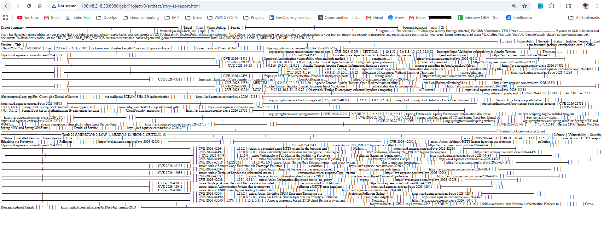
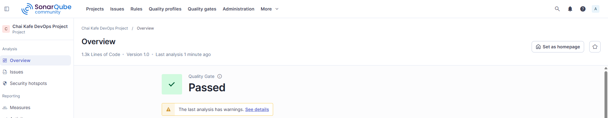
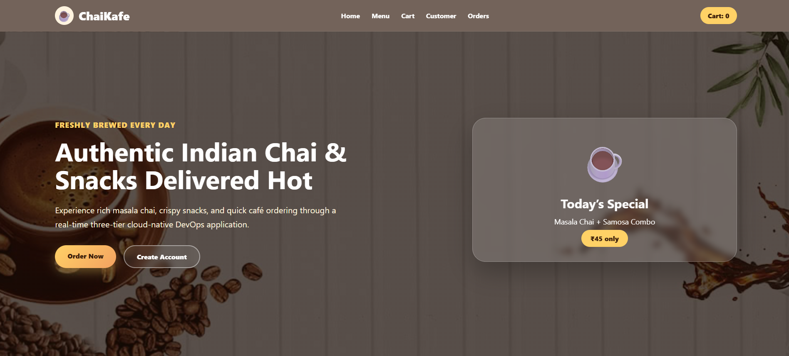
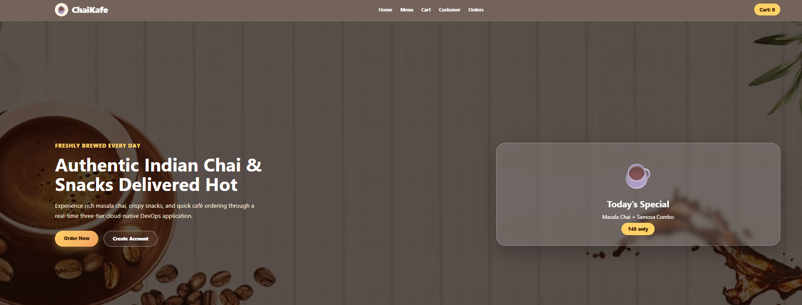
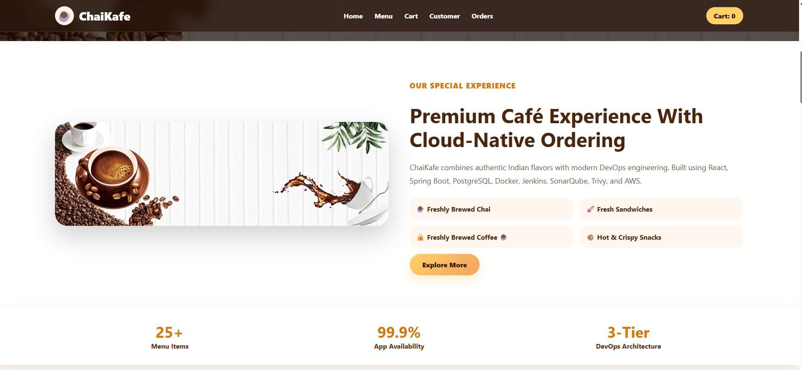
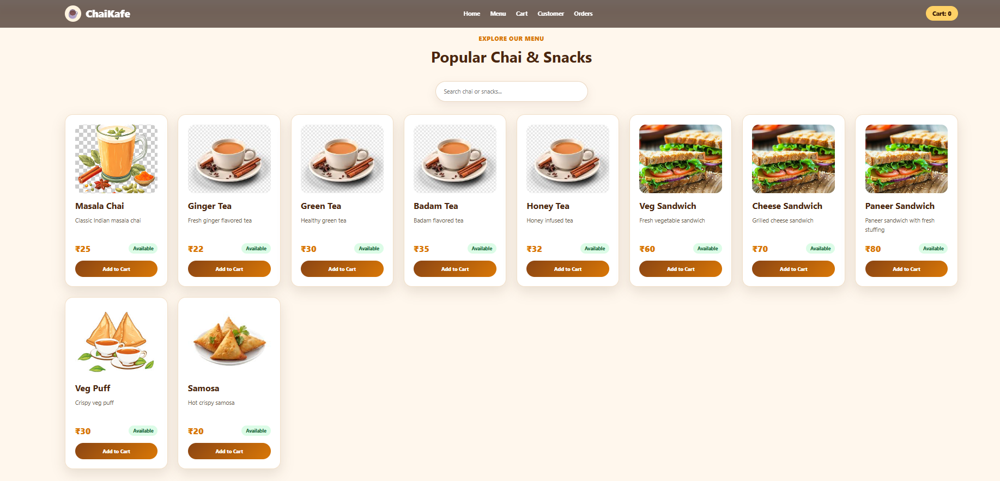
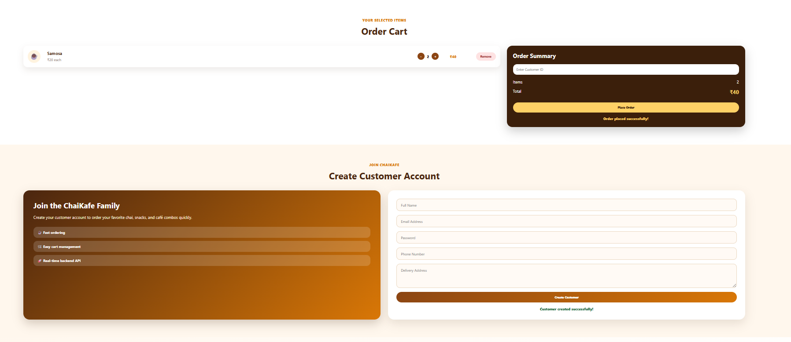
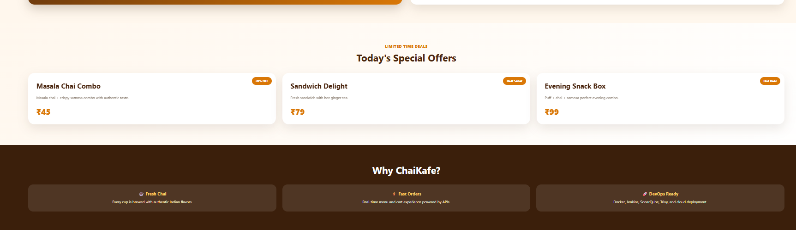
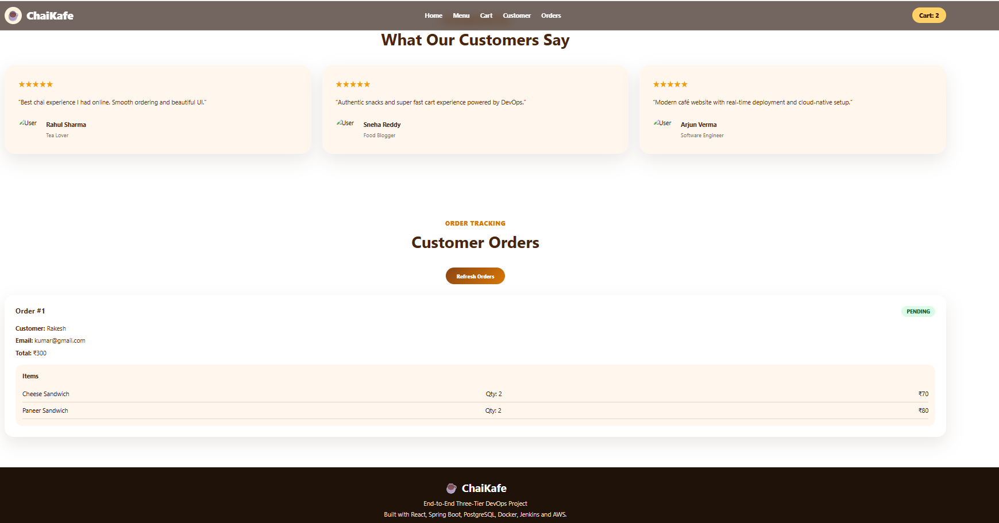

# Project-Cafe
1. Project Overview
2. Architecture
3. Tech Stack
4. Folder Structure
5. Local Docker Compose Setup
6. Jenkins CI/CD Pipeline
7. SonarQube Code Quality
8. Trivy Security Scan
9. DockerHub Images
10. Kubernetes Deployment
11. Monitoring with Prometheus and Grafana
12. AWS EKS Deployment Plan
13. Screenshots
14. Troubleshooting


# ☕ Chai Kafe – End-to-End Three-Tier DevOps Project

## 📌 Project Overview

Chai Kafe is a production-grade three-tier DevOps application designed using modern DevOps practices and cloud-native technologies.
The project demonstrates complete CI/CD automation, containerization, Kubernetes orchestration, monitoring, and security scanning workflows.

The application consists of:

* Frontend (React + Nginx)
* Backend (Spring Boot REST API)
* Database (PostgreSQL)

---

## Architecture Diagram


---

# 🏗️ Architecture

```text
User
  ↓
Ingress
  ↓
Frontend (React + Nginx)
  ↓
Backend (Spring Boot)
  ↓
PostgreSQL Database
```

---

# 🚀 Tech Stack

## Frontend

* React
* Nginx
* Docker

## Backend

* Spring Boot
* Maven
* REST APIs
* Spring Data JPA
* Actuator
* Prometheus Metrics

## Database

* PostgreSQL

## DevOps Tools

* Jenkins
* Docker
* DockerHub
* Kubernetes
* SonarQube
* Trivy
* Prometheus
* Grafana

## Cloud

* AWS EKS (Planned Deployment)

---

# 📁 Project Structure

```text
Project-Cafe/
│
├── backend/
├── frontend/
├── database/
├── kubernetes/
├── jenkins/
├── monitoring/
├── docs/
├── docker-compose.yml
├── sonar-project.properties
├── .gitignore
├── .dockerignore
└── README.md
```

---

# 🐳 Docker Compose Setup

## Build and Run

```bash
docker compose up -d --build
```

## Verify Containers

```bash
docker compose ps
```

---

# 🔍 SonarQube Code Quality

Integrated SonarQube static code analysis inside Jenkins CI pipeline.

Features:

* Code quality analysis
* Bug detection
* Code smell identification
* Quality gate validation

---

# 🔐 Trivy Security Scanning

Implemented Trivy scanning for:

* File system vulnerabilities
* Docker image vulnerabilities

---

# ⚙️ Jenkins CI/CD Pipeline

Pipeline Stages:

```text
Checkout
→ Maven Build
→ Unit Testing
→ SonarQube Analysis
→ Quality Gate
→ Trivy File System Scan
→ Docker Build
→ Trivy Image Scan
→ DockerHub Push
→ Kubernetes Deployment
```

---

# ☸️ Kubernetes Deployment

Kubernetes resources created:

* Namespace
* Secrets
* ConfigMaps
* PersistentVolumeClaims
* Deployments
* Services
* Ingress

---

# 📊 Monitoring Setup

Monitoring stack includes:

* Prometheus
* Grafana
* Spring Boot Actuator
* Micrometer Metrics

---

# 📸 Screenshots

Add screenshots for:

## 📸 Project Screenshots

### 🐳 Docker Containers Running

Shows frontend, backend, and PostgreSQL containers running successfully using Docker Compose.


---

### ☁️ DockerHub Images

Frontend and backend Docker images pushed successfully to DockerHub.


---

### 🚀 Application Output

Live ChaiKafe application UI running successfully with customer ordering workflow.


---

### 🔐 Trivy Security Scan Report

Container vulnerability scanning using Trivy integrated into Jenkins CI/CD pipeline.



---

### 📊 Sonar Analysis Report

Static code analysis and quality inspection results generated using Sonar Scanner.



---

### 🔎 SonarQube Dashboard

Code quality gates, issues, coverage, and security hotspots monitored in SonarQube.


---

# 🛠️ Troubleshooting

## Check Pods

```bash
kubectl get pods -n chai-kafe
```

## Check Logs

```bash
kubectl logs <pod-name> -n chai-kafe
```

## Restart Deployment

```bash
kubectl rollout restart deployment backend -n chai-kafe
```

---
# 🎨 Modern ChaiKafe UI Screenshots

## 🏠 Landing Page UI

Modern cloud-native café landing page with responsive hero section and premium design.



---

## ☕ Home Page

Beautiful homepage showcasing authentic Indian chai experience and DevOps-powered ordering platform.



---

## 🚀 Enhanced Home Experience

Advanced UI section with featured offers, responsive layouts, and café branding.



---

## 📋 Interactive Menu Section

Dynamic menu items loaded from Spring Boot REST APIs with real-time cart integration.



---

## 🛒 Shopping Cart & Checkout

Customer cart management with quantity controls and real-time order summary.



---

## 🎁 Special Offers Section

Modern promotional cards showcasing café combo offers and featured snacks.



---

## 📦 Customer Orders Dashboard

Real-time order tracking displaying customer details, ordered items, quantities, and total bill amount.



# 👨‍💻 Author

Rakesh Kumar
DevOps Engineer
